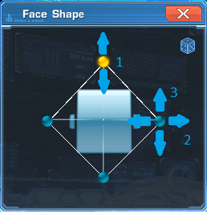
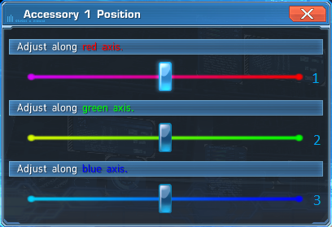

# Protocol specification

## Definitions

| Name            | Size (bytes)      | Notes                                     |
|:----------------|-------------------|-------------------------------------------|
| I8              | 1                 | Signed 8-bit integer                      |
| U8              | 1                 | Unsigned 8-bit integer                    |
| I16             | 2                 | Signed 16-bit integer                     |
| U16             | 2                 | Unsigned 16-bit integer                   |
| I32             | 4                 | Signed 32-bit integer                     |
| U32             | 4                 | Unsigned 32-bit integer                   |
| F16             | 2                 | Half-precision floating point number      |
| F32             | 4                 | Single-precision floating point number    |
| Byte[x]         | x                 | Array of bytes                            |
| Magic(xor, sub) | 4                 | See [Magic](#Magic)                       |
| AsciiString(x)  | x or varies       | Always padded to the 4 byte multiple size |
| Utf16String(x)  | (x * 2) or varies | Always padded to the 4 byte multiple size |
| Timestamp       | 4                 | UNIX timestamp                            |
| Filetime        | 8                 | Windows Filetime                          |
| Object Header   | 12                | See [Object Header](#Object-Header)       |
| Packet Flags    | 1                 | See [Packet Flags](#Packet-Flags)         |

### Magic

Most variable length values are prefixed with their length using encoded U32.

They are encoded as follows:
```
(num + sub) ^ xor
```
And decoded as:
```
(num ^ xor) - sub
```

Observation: xor and sub are probably derived from id and subid.

### Object Header

Object Header consists of the following fields:

| Name        | Type    | Notes                                                                                      |
|:------------|---------|--------------------------------------------------------------------------------------------|
| Id          | U32     | Numerical id of the object                                                                 |
| Padding?    | Byte[4] |                                                                                            |
| Entity Type | U16     | Can be one of the following: <br> 0 - Unknown <br> 4 - Player <br> 5 - Map <br> 6 - Object |
| Padding?    | Byte[2] |                                                                                            |

### Packet Flags

Copied from Polaris Server

| Name           | Value | Notes                                                      |
|:---------------|-------|------------------------------------------------------------|
| Packed         | 0x4   | Seems to be set if the packet contains magic number values |
| Flag10         | 0x10  | Unknown                                                    |
| Full Movement  | 0x20  |                                                            |
| Object Related | 0x40  |                                                            |


## Packet format

Without encryption / after decryption

Pre-NGS:
| Name     | Type         | Notes                                     |
|:---------|--------------|-------------------------------------------|
| Length   | U32          | Length of the header + data               |
| Id       | U8           |                                           |
| SubId    | U8           |                                           |
| Flags 1  | Packet Flags |                                           |
| Flags 2? | Packet Flags | Unsure if this is padding or actual flags |
| Data     | Byte[_]      |                                           |

NGS:
| Name     | Type         | Notes                       |
|:---------|--------------|-----------------------------|
| Length   | U32          | Length of the header + data |
| Flags 1  | Packet Flags |                             |
| Id       | U8           |                             |
| SubId    | U16          |                             |
| Data     | Byte[_]      |                             |

There are 3 know encryption algorithms:
 - RC4 (Vita)
 - AES (Pre-NGS Global)
 - NGS_AES (NGS)

For more information about NGS_AES see [this gist](https://gist.github.com/AntonnMal/268ba76b260539e83644f3a58abd2935). AES encryption is similar to the NGS_AES, except IV is located between the packet length and data.

TODO: Move all information to here.

## Packets

NOTICE: Information here is being moved to the code docs.

### (0x03, 0x08) Server Hello

(Server -> Client) Sent by the server when the client connects to the block server.

Data:
| Name     | Type         | Notes                   |
|:---------|--------------|-------------------------|
| ?        | U16          | Seems to be always 0x03 |
| Version? | U16          |                         |
| ?        | Byte[8]      |                         |

Respond with: [Encryption Request](#0x11-0x0b-encryption-request)

### (0x03, 0x0B) Server Ping

(Server -> Client) Sent by the server periodically.

No data.

Respond with: [Server Pong](#0x03-0x0c-server-pong)

### (0x03, 0x0C) Server Pong

(Client -> Server) Sent by the client in response to the ping.

No data.

Response to: [Server Ping](#0x03-0x0b-server-ping)

### (0x11, 0x00) SegaID Login

(Client -> Server) Client wants to authenticate using SegaID.

Flags: packed

Data:
| Name          | Type               | Notes                          |
|:--------------|--------------------|--------------------------------|
| ?             | U8                 |                                |
| ?             | U8                 |                                |
| ?             | U16                |                                |
| ?             | U32                |                                |
| ?             | U32                |                                |
| Version Id?   | Byte[0x20]         |                                |
| Length        | Magic(0x5E6, 0x6B) | Length of the following array  |
| Interfaces    | NetInterface[_]    | See [below](#netinterface)     |
| ?             | Byte[0xD4]         |                                |
| Flag?         | U32                |                                |
| Flag?         | U32                |                                |
| Flag?         | U32                |                                |
| Flag?         | U32                |                                |
| Flag?         | U32                |                                |
| Flag?         | U32                |                                |
| ?             | Byte[0x8]          |                                |
| System Locale | Utf16String(0x10)  |                                |
| ?             | Byte[0xC]          |                                |
| ?             | Byte[0x20]         |                                |
| ?             | Byte[0x44]         | Seems to be GameGuard data     |
| ?             | Byte[0x104]        |                                |
| Username      | AsciiString(0x40)  | SegaID Username                |
| Padding?      | Byte[0x20]         |                                |
| Password      | AsciiString(0x40)  | SegaID Password in clear text  |
| Padding?      | Byte[0x4]          |                                |
| ?             | U32                |                                |
| Length        | Magic(0x5E6, 0x6B) | Length of the following string |
| ?             | AsciiString        |                                |
| ?             | U32                |                                |

Respond with: [Login Response](#0x11-0x01-login-response)

Response to: [Encryption Response](#0x11-0x0c-encryption-response)

### (0x11, 0x01) Login Response

(Server -> Client) Server sends result of login attempt.

Flags: packed

Data:
| Name       | Type                | Notes                          |
|:-----------|---------------------|--------------------------------|
| Status     | U32                 | 0 - Success <br> 1 - Failure   |
| Length     | Magic(0x8BA4, 0xB6) | Length of the following string |
| Error      | Utf16String         | Error if any                   |
| Player     | ObjectHeader        | Always type = Player           |
| Block Name | Utf16String(0x20)   |                                |
| ?          | F32                 |                                |
| ?          | U32                 |                                |
| ?          | U32                 |                                |
| ?          | U32                 |                                |
| ?          | F32                 |                                |
| ?          | F32                 |                                |
| ?          | U32                 |                                |
| ?          | F32                 |                                |
| ?          | F32                 |                                |
| ?          | U32                 |                                |
| ?          | F32                 |                                |
| ?          | U32                 |                                |
| ?          | F32                 |                                |
| ?          | F32[0xA]            |                                |
| ?          | F32[0x15]           |                                |
| ?          | U32                 |                                |
| ?          | U32                 |                                |

Respond with: [Settings Request](#0x2b-0x00-settings-request), [System Information](#0x11-0x2d-system-information)

Response to: Any login packet

### (0x11, 0x02) Character List Request

(Client -> Server) Client want to get user's characters (clicked on the "Character Selection" button in the start menu).

No data.

Respond with: [Character List](#0x11-0x03-character-list)

### (0x11, 0x03) Character List

(Server -> Client) Server sends user's characters.

Data:
| Name                 | Type         | Notes                                                      |
|:---------------------|--------------|------------------------------------------------------------|
| Number of characters | U32          |                                                            |
| Padding?             | U32          |                                                            |
| Array                | Array[30]    | Fields below                                               |
| - Padding?           | U32          |                                                            |
| - Character          | Character    | If the character doesn't exist, zero out all of the fields |
| ?                    | Byte[0x41A4] |                                                            |
| Play times           | U32[30]      | Seconds played using that character                        |
| ?                    | Byte[0x20]   |                                                            |
| Array                | Array[30]    | Fields below                                               |
| - Deletion flag      | U32          | Set, if character deletion request was made                |
| - Deletion time      | Timestamp    | Time when the character will be deleted                    |
| Array                | Array[30]    | Fields below                                               |
| - Transfer flag      | U32          | Set, if character transfer request was made                |
| - ?                  | U32          |                                                            |
| Accessory Id         | U16          |                                                            |
| ?                    | Byte[0x6]    |                                                            |
| First login survey?  | U32          |                                                            |
| 12 star ad           | U32          |                                                            |

Response to: [Character List Request](#0x11-0x02-character-list-request)

### (0x11, 0x05) New Character

(Client -> Server) Client has created a new character.

Data:
| Name      | Type      | Notes                                 |
|:----------|-----------|---------------------------------------|
| Character | Character | Player Id and Character Id are zeroed |

### (0x11, 0x0B) Encryption Request

(Client -> Server) Client want to setup encryption.

Data:
| Name | Type         | Notes              |
|:-----|--------------|--------------------|
| Data | Byte[0x104]? | RSA encrypted data |

Respond with: [Encryption Response](#0x11-0x0c-encryption-response)

Response to: [Server Hello](#0x03-0x08-server-hello)

### (0x11, 0x0C) Encryption Response

(Server -> Client) Server confirms encryption.

Data:
| Name | Type         | Notes                                                                           |
|:-----|--------------|---------------------------------------------------------------------------------|
| Key  | Byte[_]      | Length is derived from total length. Contains client's key from previous packet |

Respond with: Any login packet

Response to: [Encryption Request](#0x11-0x0b-encryption-request)

### (0x11, 0x0D) Client Ping

(Client -> Server) Sent by the client periodically.

Data:
| Name          | Type     |
|:--------------|----------|
| Client's time | Filetime |

Respond with: [Client Pong](#0x11-0x0e-client-pong)

### (0x11, 0x0E) Client Pong

(Server -> Client) Sent by the server in response to the ping.

Data:
| Name          | Type     | Notes                      |
|:--------------|----------|----------------------------|
| Client's time | Filetime | Timestamp from ping packet |
| Server's time | Filetime |                            |

Response to: [Client Ping](#0x11-0x0d-client-ping)

### (0x11, 0x1E) Nickname Request

(Server -> Client) Server asks the client for a nickname.

Data:
| Name        | Type       | Notes                                         |
|:------------|------------|-----------------------------------------------|
| Error?      | U16?       | 1 if nickname is the same as Sega ID username |
| ?           | Byte[0x42] |                                               |

Respond with: [Set Nickname](#0x11-0x1d-set-nickname) OR [Nickname Error](#0x11-0xea-nickname-error)

Response to: [SegaID Login?](#0x11-0x00-segaid-login)

### (0x11, 0x1D) Set Nickname

(Client -> Server) Client sends a desired nickname.

Data:
| Name     | Type              |
|:---------|-------------------|
| Nickname | Utf16String(0x10) |
| ?        | Byte[0x20]        |

Response to: [Nickname Request](#0x11-0x1e-nickname-request)

### (0x11, 0x2B) Client Goodbye

(Client -> Server) Client signals the server that it wants to disconnect

No data.

Followed by: [Save Settings](#0x2b-0x01-save-settings) (only on game exit)

Respond with: disconnect

### (0x11, 0x2D) System Information

(Client -> Server) Client sends information about the user's hardware.

Flags: packed

Data:
| Name                  | Type                | Notes                          |
|:----------------------|---------------------|--------------------------------|
| Length                | Magic(0x883D, 0x9F) | Length of the following string |
| CPU Info              | AsciiString         |                                |
| Length                | Magic(0x883D, 0x9F) | Length of the following string |
| GPU Info              | AsciiString         |                                |
| Video RAM             | U64                 |                                |
| Total RAM             | U64                 |                                |
| ?                     | U32                 |                                |
| ?                     | U32                 |                                |
| Length                | Magic(0x883D, 0x9F) | Length of the following string |
| Windows Version       | Utf16String         |                                |
| Length                | Magic(0x883D, 0x9F) | Length of the following string |
| Window Size           | AsciiString         |                                |
| Length                | Magic(0x883D, 0x9F) | Length of the following string |
| ?                     | Utf16String         |                                |
| Length                | Magic(0x883D, 0x9F) | Length of the following string |
| ?                     | Utf16String         |                                |
| Length                | Magic(0x883D, 0x9F) | Length of the following string |
| Video Driver          | Utf16String         |                                |
| Total Hard Disk Space | U64                 |                                |
| Free Hard Disk Space  | U64                 |                                |

Response to: [Login Response](#0x11-0x01-login-response)

### (0x11, 0x3D) Ship List

(Server -> Client) Sent by the Info server.

Flags: packed

Data:
| Name      | Type                | Notes                                                                        |
|:----------|---------------------|------------------------------------------------------------------------------|
| Length    | Magic(0xE418, 0x51) | Length of the following array                                                |
| Ships     | Array[_]            | Fields below                                                                 |
| - Id      | U32                 |                                                                              |
| - Name    | Utf16String(0x10)   | Has the format of "Ship{Id}"                                                 |
| - ?       | U32                 |                                                                              |
| - Status  | U16                 | 0 - Maintenance <br> 1 - Online <br> 2 - Busy <br> 3 - Full <br> 4 - Offline |
| - Order?  | U16                 |                                                                              |
| - ?       | U32                 |                                                                              |
| Timestamp | Timestamp           |                                                                              |

### (0x11, 0x41) Create Character 1 Request

(Client -> Server) Client wants to create a new character.

No data.

Respond with: [Create Character 1 Response](#0x11-0x42-create-character-1-response)

### (0x11, 0x42) Create Character 1 Response

(Server -> Client) Server sends information about creation ability.

Data:
| Name        | Type | Notes                                                                                         |
|:------------|------|-----------------------------------------------------------------------------------------------|
| Status      | U32  | 0 - Able to create <br> 1 - Limit reached <br> 2 - Permit required <br> 4 - Creation disabled |
| ?           | U32  |                                                                                               |
| Slots used  | U32  |                                                                                               |
| AC required | U322 | Used when status is 2                                                                         |

Respond with: [Create Character 2 Request](#0x11-0x54-create-character-2-request) (if status = 0)

Response to: [Create Character 1 Request](#0x11-0x41-create-character-1-request)

### (0x11, 0x54) Create Character 2 Request

(Client -> Server) 

No data.

Respond with: [Create Character 2 Response](#0x11-0x55-create-character-2-response)

Response to: [Create Character 1 Request](#0x11-0x42-create-character-1-response)

### (0x11, 0x55) Create Character 2 Response

(Server -> Client) 

Data:
| Name               | Type | Notes                          |
|:-------------------|------|--------------------------------|
| Friend Bonus taken | U32  | 1 if bonus was already claimed |

Response to: [Create Character 2 Request](#0x11-0x54-create-character-2-request)

### (0x11, 0x63) PSN Login

(Client -> Server) Client wants to authenticate using PSN.

Flags: packed

Data:
| Name          | Type                | Notes                          |
|:--------------|---------------------|--------------------------------|
| ?             | U8                  |                                |
| ?             | U8                  |                                |
| ?             | U16                 |                                |
| ?             | U32                 |                                |
| ?             | U32                 |                                |
| Version Id?   | Byte[0x20]          |                                |
| Length        | Magic(0xBE3F, 0x77) | Length of the following array  |
| Interfaces    | NetInterface[_]     | See [below](#netinterface)                      |
| ?             | Byte[0xD4]          |                                |
| Flag?         | U32                 |                                |
| Flag?         | U32                 |                                |
| Flag?         | U32                 |                                |
| Flag?         | U32                 |                                |
| Flag?         | U32                 |                                |
| Flag?         | U32                 |                                |
| ?             | Byte[0x8]           |                                |
| System Locale | Utf16String(0x10)   |                                |
| ?             | Byte[0xC]           |                                |
| ?             | Byte[0x20]          |                                |
| ?             | Byte[0x44]          |                                |
| ?             | Byte[0x104]         |                                |
| Username      | AsciiString(0x40)   | PSN Name                       |
| Padding?      | Byte[0x20]          |                                |
| Password      | AsciiString(0x40)   | Always "guest"                 |
| Padding?      | Byte[0x4]           |                                |
| ?             | U32                 |                                |
| Length        | Magic(0xBE3F, 0x77) | Length of the following string |
| ?             | AsciiString         |                                |
| ?             | U32                 |                                |
| Length        | Magic(0xBE3F, 0x77) | Length of the following array  |
| ?             | Byte[_]             | Something to do with PSN       |
| ?             | Byte[0x10]          |                                |

Respond with: [Login Response](#0x11-0x01-login-response)

Response to: [Encryption Response](#0x11-0x0c-encryption-response)

### (0x11, 0x6B) SegaID Info Request

(Client -> Server) Clients wants to get SegaID username.

No data.

Respond with: (0x11, 0x6C)

### (0x11, 0x86) Login History Request

(Client -> Server) Client wants to get login history.

No data.

Respond with: [Login History](#0x11-0x87-login-history)

### (0x11, 0x87) Login History

(Server -> Client) Server sends last 50 login attempts.

Flags: packed

Data:
| Name     | Type               | Notes                         |
|:---------|--------------------|-------------------------------|
| Length   | Magic(0x8ceb, 0x8) | Length of the following array |
| Attempts | Array[_]           | Fields bellow                 |
| - IP     | Byte[4]            |                               |
| - Status | U32                | 0 - Success <br> 1 - Email confirmed <br> 2 - Login error <br> 3 - Email auth error <br> 4 - Auth email sent <br> 5 - OTP Error <br> 6 - Maintenance login <br> 7 - Generic error |
| - Time   | Timestamp          |                               |
| - ?      | U32                |                               |

Response to: [Login History Request](#0x11-0x86-login-history-request)

### (0x11, 0xEA) Nickname Error

(Client -> Server) User entered an illegal nickname (e.g. "sega").

Flags: packed

Data: 
| Name     | Type                | Notes                          |
|:---------|---------------------|--------------------------------|
| ?        | U32                 |                                |
| Length   | Magic(0x4544, 0x14) | Length of the following string |
| Nickname | Utf16String         |                                |

Response to: [Nickname Request](#0x11-0x1e-nickname-request)

### (0x11, 0xEE) Email Code Request

(Server -> Client) Server requests a code sent by email.

Flags: packed

Data: 
| Name    | Type                | Notes                          |
|:--------|---------------------|--------------------------------|
| ?       | U32                 |                                |
| Length  | Magic(0x5C3B, 0x40) | Length of the following string |
| Message | Utf16String         |                                |

### (0x19, 0x01) System Message

(Server -> Client) 

Flags: packed

Data:
| Name    | Type                | Notes                                                                                                  |
|:--------|---------------------|--------------------------------------------------------------------------------------------------------|
| Length  | Magic(0x78F7, 0xA2) | Length of the following string                                                                         |
| Message | Utf16String         |                                                                                                        |
| Length  | Magic(0x78F7, 0xA2) | Length of the following string                                                                         |
| ?       | Utf16String         |                                                                                                        |
| Type    | U32                 | 0 - ? <br> 1 - Admin Message <br> 2 - Skippable Admin Message <br> 3 - System Message <br> 4 - Generic |
| ?       | U32                 |                                                                                                        |

### (0x2B, 0x00) Settings Request

(Client -> Server) Client wants to get settings.

No data.

Respond with: [Load Settings](#0x2b-0x02-load-settings)

### (0x2B, 0x01) Save Settings

(Client -> Server) Client wants to save settings.

Flags: packed

Data:
| Name     | Type                | Notes                          |
|:---------|---------------------|--------------------------------|
| Length   | Magic(0xCEF1, 0xB5) | Length of the following string |
| Settings | AsciiString         | INI Settings                   |

### (0x2B, 0x02) Load Settings

(Server -> Client) Server send user's settings.

Flags: packed

Data:
| Name     | Type                 | Notes                          |
|:---------|----------------------|--------------------------------|
| Length   | Magic(0x54AF, 0x100) | Length of the following string |
| Settings | AsciiString          | INI Settings                   |

Response to: [Settings Request](#0x2b-0x00-settings-request)

## Models

### NetInterface

| Name        | Type              | Notes                         |
|:------------|-------------------|-------------------------------|
| State?      | u32               |                               |
| Mac Address | AsciiString(0x18) | Mac Address of the interface. |

### Character (Pre-NGS)

| Name         | Type              | Notes          |
|:-------------|-------------------|----------------|
| Character Id | U32               |                |
| Player Id    | U32               |                |
| ?            | U32               |                |
| Voice Type   | U32               |                |
| ?            | U16               |                |
| Voice Pitch  | U16               |                |
| Name         | Utf16String(0x10) |                |
| Padding?     | U32               | Only on Vita   |
| Look         | Look              |                |
| Classes      | ClassInfo         |                |
| ?            | Byte[0x96]        |                |
| Padding?     | U32               | Only on Global |

#### Look

| Name                 | Type       | Notes                                                                         |
|:---------------------|------------|-------------------------------------------------------------------------------|
| Running Animation    | U16        |                                                                               |
| Race                 | U16        | 0 - Human <br> 1 - Newman <br> 2 - CAST <br> 3 - Deuman <br> 0xFFFF - Unknown |
| Gender               | U16        | 0 - Male <br> 1 - Female <br> 0xFFFF - Unknown                                |
| Muscule              | U16        |                                                                               |
| Body                 | Figure     |                                                                               |
| Arms                 | Figure     |                                                                               |
| Legs                 | Figure     |                                                                               |
| Chest                | Figure     |                                                                               |
| Face Shape           | Figure     |                                                                               |
| Face Parts           | Figure     |                                                                               |
| Eyes                 | Figure     |                                                                               |
| Nose Size            | Figure     |                                                                               |
| Nose Height          | Figure     |                                                                               |
| Mouth                | Figure     |                                                                               |
| Ears                 | Figure     |                                                                               |
| Neck                 | Figure     |                                                                               |
| Waist                | Figure     |                                                                               |
| Body                 | Figure     | Duplicate of the above                                                        |
| Arms                 | Figure     | Duplicate of the above                                                        |
| Legs                 | Figure     | Duplicate of the above                                                        |
| Chest                | Figure     | Duplicate of the above                                                        |
| Neck                 | Figure     | Duplicate of the above                                                        |
| Waist                | Figure     | Duplicate of the above                                                        |
| ?                    | Byte[0x2A] |                                                                               |
| Accessory 1 Location | Accessory  |                                                                               |
| Accessory 2 Location | Accessory  |                                                                               |
| Accessory 3 Location | Accessory  |                                                                               |
| Accessory 4 Location | Accessory  |                                                                               |
| ?                    | HSVColor   |                                                                               |
| Costume Color?       | HSVColor   |                                                                               |
| Main Color           | HSVColor   |                                                                               |
| Sub Color 1          | HSVColor   |                                                                               |
| Sub Color 2          | HSVColor   |                                                                               |
| Sub Color 3          | HSVColor   |                                                                               |
| Eye Color            | HSVColor   |                                                                               |
| Hair Color           | HSVColor   |                                                                               |
| ?                    | Byte[0x30] |                                                                               |
| Costume Id           | U16        |                                                                               |
| Body Paint 1 Id      | U16        |                                                                               |
| Sticker Id           | U16        |                                                                               |
| Right Eye Id         | U16        |                                                                               |
| Eyebrow Id           | U16        |                                                                               |
| Eyelash Id           | U16        |                                                                               |
| Face Id 1?           | U16        |                                                                               |
| Face Id 2?           | U16        |                                                                               |
| Face Makeup 1 Id     | U16        |                                                                               |
| Hairstyle Id         | U16        |                                                                               |
| Accessory 1 Id       | U16        |                                                                               |
| Accessory 2 Id       | U16        |                                                                               |
| Accessory 3 Id       | U16        |                                                                               |
| Face Makeup 2 Id     | U16        |                                                                               |
| Leg Id               | U16        |                                                                               |
| Arm Id               | U16        |                                                                               |
| Accessory 4 Id       | U16        |                                                                               |
| ?                    | Byte[0x4]  |                                                                               |
| Body Paint 2 Id      | U16        |                                                                               |
| Left Eye Id          | U16        |                                                                               |
| ?                    | Byte[0x12] |                                                                               |
| Accessory 1 Size     | Accessory  |                                                                               |
| Accessory 2 Size     | Accessory  |                                                                               |
| Accessory 3 Size     | Accessory  |                                                                               |
| Accessory 4 Size     | Accessory  |                                                                               |
| Accessory 1 Rotation | Accessory  |                                                                               |
| Accessory 2 Rotation | Accessory  |                                                                               |
| Accessory 3 Rotation | Accessory  |                                                                               |
| Accessory 4 Rotation | Accessory  |                                                                               |
| ?                    | U16        |                                                                               |
| ?                    | Byte[0x8]  |                                                                               |
| Skin Color Type      | U8         |                                                                               |
| Eyebrow Thickness    | U8         |                                                                               |

#### Figure 

Figure data consists of 3 U16 values representing the following axis:



#### Accessory

Accessory data consists of 3 I8 values representing the following sliders:



#### HSVColor

| Name       | Type |
|:-----------|------|
| Hue        | U16  |
| Saturation | U16  |
| Value      | U16  |

#### ClassInfo

| Name                 | Type            | Notes                                                                         |
|:---------------------|-----------------|-------------------------------------------------------------------------------|
| ?                    | U32             |                         |
| Main Class           | U8              | 0 - Hunter <br> 1 - Ranger <br> 2 - Force <br> 3 - Fighter <br> 4 - Gunner <br> 5 - Techer <br> 6 - Braver <br> 7 - Bouncer <br> 8 - Challenger <br> 9 - Summoner <br> 10 - Battle Warrior <br> 11 - Hero <br> 12 - Phantom <br> 13 - Etole <br> 14 - Luster <br> 0xFF - None |
| Sub Class            | U8              | Same as above           |
| ?                    | U16             |                         |
| Enabled Classes      | U16             | Flags, currently unsure |
| ?                    | U16             |                         |
| Hunter Level         | ClassLevel      |                         |
| Ranger Level         | ClassLevel      |                         |
| Force Level          | ClassLevel      |                         |
| Fighter Level        | ClassLevel      |                         |
| Gunner Level         | ClassLevel      |                         |
| Techer Level         | ClassLevel      |                         |
| Braver Level         | ClassLevel      |                         |
| Bouncer Level        | ClassLevel      |                         |
| Challenger Level     | ClassLevel      |                         |
| Summoner Level       | ClassLevel      |                         |
| Battle Warrior Level | ClassLevel      |                         |
| Hero Level           | ClassLevel      |                         |
| Phantom Level        | ClassLevel      |                         |
| Etole Level          | ClassLevel      |                         |
| Luster Level         | ClassLevel      |                         |
| Unused Levels        | ClassLevel[0x9] |                         |
| Max Levels           | U16[0xF]        |                         |

#### ClassLevel

| Name   | Type | Notes                                                                           |
|:-------|------|---------------------------------------------------------------------------------|
| Level  | U16  |                                                                                 |
| Level? | U16  | Usually the same as the above, but it seems to be higher when main level is 75+ |
| Exp    | U32  |                                                                                 |
